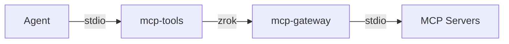
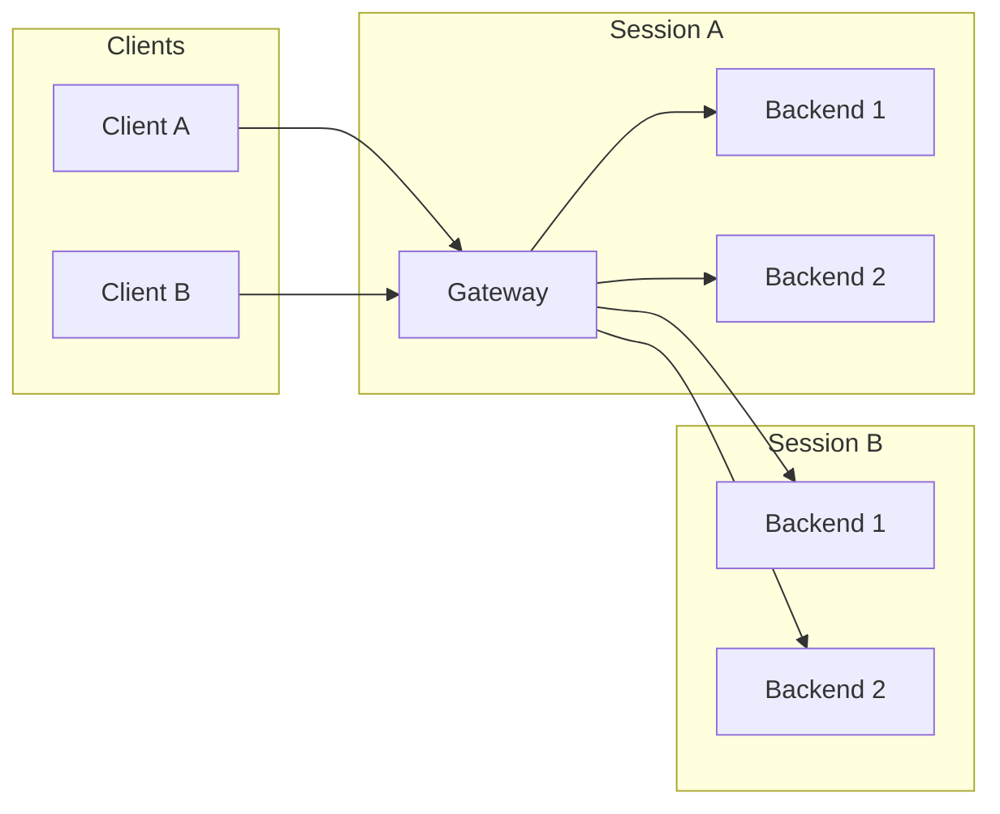

# MCP Gateway

**Zero-trust access to MCP tools over OpenZiti**

MCP Gateway lets AI assistants securely access internal tools without exposing public endpoints. Built on OpenZiti and zrok, it provides cryptographically secure, zero trust connectivity with no attack surface.

MCP Gateway is sponsored by [NetFoundry](https://netfoundry.io) as part of its portfolio of solutions for secure workloads and agentic computing. NetFoundry is the creator of [OpenZiti](https://netfoundry.io/docs/openziti/) and [zrok](https://netfoundry.io/docs/zrok/getting-started).

## The Trifecta

Three simple components that work together:

| Component | Purpose |
|-----------|---------|
| **mcp-tools** | Connects MCP clients to remote shares (stdio or HTTP), manages reserved shares |
| **mcp-gateway** | Aggregates multiple backends into one secure endpoint (SSE/HTTP) |
| **mcp-bridge** | Exposes a single MCP server to the network (SSE/HTTP) |



## Why?

**Problem:** MCP servers typically run locally via stdio. To access tools on remote machines or share them across a team, you need to expose endpoints—creating security risks. Securing exposed MCP tooling can be complicated.

**Solution:** MCP Gateway uses OpenZiti's overlay network to create "dark services" that:
- Never listen on public IPs
- Require cryptographic identity to access
- Work through NATs and firewalls without port forwarding
- Are incredibly simple to deploy securely

## Quick Start

> **New to MCP Gateway?** See the [Getting Started Guide](GETTING-STARTED.md) for a complete walkthrough.

### 1. Install

```bash
go install github.com/openziti/mcp-gateway/cmd/mcp-gateway@latest
go install github.com/openziti/mcp-gateway/cmd/mcp-bridge@latest
go install github.com/openziti/mcp-gateway/cmd/mcp-tools@latest
```

### 2. Enable zrok

> **Note:** mcp-gateway requires zrok `v2.0.x` or later. Currently the best release is [zrok v2.0.0-rc5](https://github.com/openziti/zrok/releases/tag/v2.0.0-rc5)

```bash
zrok2 enable <your-zrok-token>  # get token at https://api-v2.zrok.io
```

### 3. Run a Gateway

Create `config.yml`:
```yaml
aggregator:
  name: "my-gateway"
  version: "1.0.0"

backends:
  - id: filesystem
    transport:
      type: stdio
      command: npx
      args: ["-y", "@modelcontextprotocol/server-filesystem", "/home/user/documents"]

  - id: github
    transport:
      type: stdio
      command: npx
      args: ["-y", "@modelcontextprotocol/server-github"]
      env:
        GITHUB_TOKEN: "ghp_xxx"
```

```bash
mcp-gateway run config.yml
# outputs: {"share_token":"abc123..."}
```

### 4. Connect from Agent

Add to agent config:
```json
{
  "mcpServers": {
    "my-tools": {
      "command": "mcp-tools",
      "args": ["run", "abc123..."]
    }
  }
}
```

That's it. Your agent can now use tools from both backends through a single secure connection.

## Use Cases

### Aggregate Multiple Tool Servers

Combine filesystem, GitHub, database, and custom tools into one connection:

```yaml
backends:
  - id: fs
    transport: { type: stdio, command: mcp-server-filesystem, args: ["/data"] }
  - id: github
    transport: { type: stdio, command: mcp-server-github }
  - id: postgres
    transport: { type: stdio, command: mcp-server-postgres }
```

Tools are namespaced automatically: `fs:read_file`, `github:create_issue`, `postgres:query`.

### Expose a Remote Tool Server

Run mcp-bridge on a remote machine to expose a local MCP server:

```bash
# on remote server
mcp-bridge mcp-server-custom --config /etc/custom.yml
# outputs share token

# from anywhere
mcp-tools run <share_token>
```

### Chain Bridges and Gateways

Gateway can connect to remote bridges as backends:

```yaml
backends:
  - id: remote-tools
    transport:
      type: zrok
      share_token: "token-from-bridge"
```

### Reserved Shares

By default, `mcp-gateway` and `mcp-bridge` create an ephemeral share that disappears when the process exits. **Reserved shares** persist server-side in zrok, so a gateway or bridge can stop and restart without changing the share token.

```bash
# create a reserved share with a chosen name
mcp-tools create my-gateway
# outputs: {"share_token":"my-gateway"}

# use the token in a gateway config (share_token: my-gateway) or bridge
mcp-gateway run config.yml
mcp-bridge --share-token my-gateway npx -y @modelcontextprotocol/server-filesystem /home/user

# the gateway/bridge can restart and reconnect to the same share

# when done, delete the share
mcp-tools delete my-gateway
```

If you omit the name, zrok generates a random token:

```bash
mcp-tools create
# outputs: {"share_token":"abc123xyz"}
```

The token name must be 3–32 characters, lowercase alphanumeric and hyphens (`[a-z0-9-]`).

### HTTP Transport

All components support HTTP-based MCP transport in addition to stdio.

**Serve via HTTP with mcp-tools:**
```bash
# expose a zrok share as a local HTTP server
mcp-tools http <share_token> --bind 127.0.0.1:8080
```

Options:
- `--stateless` - Stateless mode (no session persistence)
- `--json-response` - Prefer JSON responses over SSE streams

The gateway and bridge natively serve MCP over HTTP/SSE through zrok. Use `mcp-tools http` when you need a local HTTP endpoint for clients that don't support the `stdio` transport provided by `mcp-tools` directly.

## Tool Filtering

Control which tools are exposed per backend:

```yaml
backends:
  - id: filesystem
    transport: { type: stdio, command: mcp-server-filesystem }
    tools:
      mode: allow
      list:
        - "read_file"
        - "list_directory"
        # write operations not exposed

  - id: github
    tools:
      mode: deny
      list:
        - "delete_*"
        # everything except delete operations
```

## Architecture

MCP Gateway creates isolated sessions for each connecting client:



Each client gets dedicated backend connections—no shared state, no cross-talk.

## Building from Source

```bash
git clone https://github.com/openziti/mcp-gateway.git
cd mcp-gateway
go build ./cmd/mcp-gateway
go build ./cmd/mcp-bridge
go build ./cmd/mcp-tools
```

## Documentation

- [Example Configuration](etc/mcp-gateway.yml) - Fully documented configuration file
- [OpenZiti Documentation](https://openziti.io/docs)
- [zrok Documentation](https://docs.zrok.io)
- [MCP Specification](https://modelcontextprotocol.io)

## License

Apache 2.0 - see [LICENSE](LICENSE)
