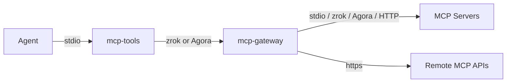
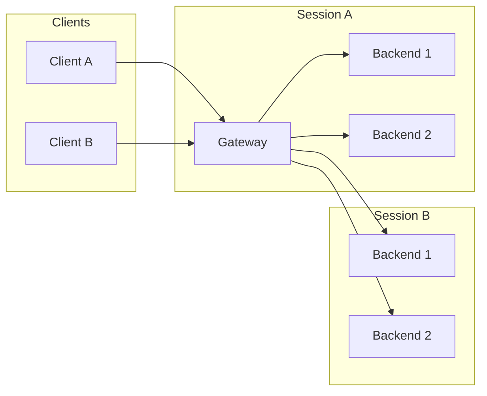

# MCP Gateway

**Zero-trust access to MCP tools over OpenZiti**

MCP Gateway lets AI assistants securely access internal tools without exposing public endpoints. Built on OpenZiti, zrok, and [Agora](https://github.com/openziti/agora), it provides cryptographically secure, zero trust connectivity with no attack surface.

MCP Gateway is sponsored by [NetFoundry](https://netfoundry.io) as part of its portfolio of solutions for secure workloads and agentic computing. NetFoundry is the creator of [OpenZiti](https://netfoundry.io/docs/openziti/) and [zrok](https://netfoundry.io/docs/zrok/getting-started).

## The Trifecta

Three simple components that work together:

| Component | Purpose |
|-----------|---------|
| **mcp-tools** | Connects MCP clients to remote zrok shares or Agora tunnels (stdio or HTTP) |
| **mcp-gateway** | Aggregates multiple backends into one secure endpoint over zrok and/or Agora |
| **mcp-bridge** | Exposes a single MCP server to the network over zrok or Agora |


```mermaid
flowchart LR
    A[Agent] -->|stdio| B[mcp-tools]
    B -->|zrok or Agora| C[mcp-gateway]
    C -->|stdio / zrok / Agora / HTTP| D[MCP Servers]
    C -->|https| E[Remote MCP APIs]
```

## Why?

**Problem:** MCP servers typically run locally via stdio. To access tools on remote machines or share them across a team, you need to expose endpoints—creating security risks. Securing exposed MCP tooling can be complicated.

**Solution:** MCP Gateway uses OpenZiti's overlay network to create "dark services" that:
- Never listen on public IPs
- Require cryptographic identity to access
- Work through NATs and firewalls without port forwarding
- Can publish and serve through Agora catalogs and Layer 1 tunnels
- Are incredibly simple to deploy securely

## Quick Start

> **New to MCP Gateway?** See the [Getting Started Guide](docs/current/getting-started.md) for a complete walkthrough.

### 1. Install

```bash
go install github.com/openziti/mcp-gateway/cmd/...@latest
```

### 2. Enable zrok

> **Note:** mcp-gateway requires zrok `v2.0.x` or later. Currently the best release is [zrok v2.0.0-rc7](https://github.com/openziti/zrok/releases/tag/v2.0.0-rc7)

```bash
zrok2 enable <your-zrok-token>  # get token at https://api-v2.zrok.io
```

### 3. Run a Gateway

Create `config.yml`:
```yaml
aggregator:
  name: "my-gateway"
  version: "1.0.0"

backends:
  - id: filesystem
    transport:
      type: stdio
      command: npx
      args: ["-y", "@modelcontextprotocol/server-filesystem", "/home/user/documents"]

  - id: github
    transport:
      type: stdio
      command: npx
      args: ["-y", "@modelcontextprotocol/server-github"]
      env:
        GITHUB_TOKEN: "ghp_xxx"
```

```bash
mcp-gateway run config.yml
# outputs: {"share_token":"abc123..."}
```

### 4. Connect from Agent

Add to agent config:
```json
{
  "mcpServers": {
    "my-tools": {
      "command": "mcp-tools",
      "args": ["run", "abc123..."]
    }
  }
}
```

That's it. Your agent can now use tools from both backends through a single secure connection.

## Use Cases

### Aggregate Multiple Tool Servers

Combine filesystem, GitHub, database, and custom tools into one connection:

```yaml
backends:
  - id: fs
    transport: { type: stdio, command: mcp-server-filesystem, args: ["/data"] }
  - id: github
    transport: { type: stdio, command: mcp-server-github }
  - id: postgres
    transport: { type: stdio, command: mcp-server-postgres }
```

Tools are namespaced automatically: `fs:read_file`, `github:create_issue`, `postgres:query`.

### Expose a Remote Tool Server

Run mcp-bridge on a remote machine to expose a local MCP server:

```bash
# on remote server
mcp-bridge mcp-server-custom --config /etc/custom.yml
# outputs share token

# from anywhere
mcp-tools run <share_token>
```

### Chain Bridges and Gateways

Gateway can connect to remote bridges (or other gateways) as backends:

```yaml
backends:
  - id: remote-tools
    transport:
      type: zrok
      share_token: "token-from-bridge"
```

### Serve and Discover Through Agora

Gateway, bridge, and tools can use Agora Layer 1 tunnels in addition to zrok. A gateway can serve over zrok and Agora at the same time, publish a catalog advertisement, and connect to backends exposed by `mcp-bridge --network=agora`.

```yaml
agora:
  enabled: true
  serve:
    enabled: true
  advertisement:
    publish: true

backends:
  - id: remote-filesystem
    transport:
      type: agora
      agora_tunnel: filesystem-relay
```

```bash
mcp-tools run --agora mcp-gateway-engineering
```

See [Agora Integration](docs/current/agora.md) for configuration, CLI flags, integration files, and smoke scenarios.

### Connect to HTTP and HTTPS MCP Servers

Gateway can aggregate remote MCP servers over HTTP(S), using either Streamable HTTP (the default) or the legacy SSE transport. Set `protocol: sse` explicitly for an SSE endpoint. `type: https` is strict and only accepts `https://` endpoints. `type: http` supports both `http://` and `https://`, but plaintext HTTP requires explicit opt-in.

```yaml
backends:
  - id: remote-api
    transport:
      type: https
      endpoint: "https://mcp.example.com/mcp"
      headers:
        Authorization: "Bearer sk-abc123"

  - id: legacy-api
    transport:
      type: https
      endpoint: "https://mcp.internal.corp/sse"
      protocol: "sse"
      tls:
        ca_cert_file: "/etc/ssl/certs/internal-ca.pem"
```

This works alongside stdio and zrok backends — mix and match as needed.

For local development or trusted internal networks, you can opt into plaintext HTTP explicitly:

```yaml
backends:
  - id: local-dev
    transport:
      type: http
      endpoint: "http://localhost:8080/mcp"
      allow_insecure: true
```

HTTP backend clients connect directly and refuse redirects by default. Set `allow_environment_proxy: true` or `allow_redirects: true` on the transport only when that wider network behavior is deliberate.

### Persistent Shares

By default, `mcp-gateway` and `mcp-bridge` create an ephemeral share that disappears when the process exits. **Persistent shares** are stored server-side in zrok, so a gateway or bridge can stop and restart without changing the share token.

Ephemeral shares are closed and owner-only by default. A bridge can grant other zrok accounts with a repeatable flag:

```bash
mcp-bridge --access-grant teammate@example.com mcp-filesystem /data
```

For `mcp-gateway`, put the same account emails under `zrok.share.access_grants` in the gateway configuration. The creating account does not belong in the list; it already has access.

```bash
# create a persistent share with a chosen name
zrok2 create share my-gateway
# outputs the share token

# use the token in a gateway config (share_token: my-gateway) or bridge
mcp-gateway run config.yml
mcp-bridge --share-token my-gateway npx -y @modelcontextprotocol/server-filesystem /home/user

# the gateway/bridge can restart and reconnect to the same share

# when done, delete the share
zrok2 delete share my-gateway
```

If you omit the name, zrok generates a random token:

```bash
zrok2 create share
# outputs the share token
```

The token name must be 3–32 characters, lowercase alphanumeric and hyphens (`[a-z0-9-]`).

### HTTP Transport

All components support HTTP-based MCP transport in addition to stdio.

**Serve via HTTP with mcp-tools:**
```bash
# expose a zrok share as a local HTTP server
mcp-tools http <share_token> --bind 127.0.0.1:8080

# expose an Agora tunnel as a local HTTP server
mcp-tools http --agora <tunnel> --bind 127.0.0.1:8080
```

Options:
- `--stateless` - Stateless mode (no session persistence)
- `--json-response` - Prefer JSON responses over streamed responses

The gateway and bridge natively serve MCP over Streamable HTTP through zrok and Agora. Use `mcp-tools http` when you need a local Streamable HTTP endpoint for clients that don't support the `stdio` transport provided by `mcp-tools` directly.

Inactive Streamable HTTP sessions expire after 30 minutes so a client that disappears without terminating its session cannot retain dedicated backend connections or bridge subprocesses indefinitely. Set `session_idle_timeout` in gateway YAML or pass `mcp-bridge --session-idle-timeout <duration>` to tune that bound. An explicit `0` disables idle expiry and may retain those resources until the client terminates its session or the server shuts down.

## Tool Filtering

Control which tools are exposed per backend:

```yaml
backends:
  - id: filesystem
    transport: { type: stdio, command: mcp-server-filesystem }
    tools:
      mode: allow
      list:
        - "read_file"
        - "list_directory"
        # write operations not exposed

  - id: github
    tools:
      mode: deny
      list:
        - "delete_*"
        # everything except delete operations
```

## Architecture

MCP Gateway creates isolated sessions for each connecting client:


```mermaid
flowchart LR
    subgraph Clients
        A[Client A]
        B[Client B]
    end

    A --> G[Gateway]
    B --> G

    subgraph Session A
        G --> A1[Backend 1]
        G --> A2[Backend 2]
    end

    subgraph Session B
        G --> B1[Backend 1]
        G --> B2[Backend 2]
    end
```

Each client gets dedicated backend connections—no shared state, no cross-talk.

## Building from Source

```bash
git clone https://github.com/openziti/mcp-gateway.git
cd mcp-gateway
go build ./cmd/mcp-gateway
go build ./cmd/mcp-bridge
go build ./cmd/mcp-tools
```

Each binary has a `version` subcommand that prints build metadata:

```bash
mcp-gateway version
```

Local builds report a developer build (e.g. `v0.1.x [developer build]`); release binaries are stamped with the version, commit, build date, branch, and builder.

## Documentation

- [Example Configuration](etc/mcp-gateway.yml) - Fully documented configuration file
- [Agora Integration](docs/current/agora.md) - Agora serving, backend connects, mcp-tools dialing, and smoke scenarios
- [OpenZiti Documentation](https://openziti.io/docs)
- [zrok Documentation](https://docs.zrok.io)
- [MCP Specification](https://modelcontextprotocol.io)

## License

Apache 2.0 - see [LICENSE](LICENSE)
