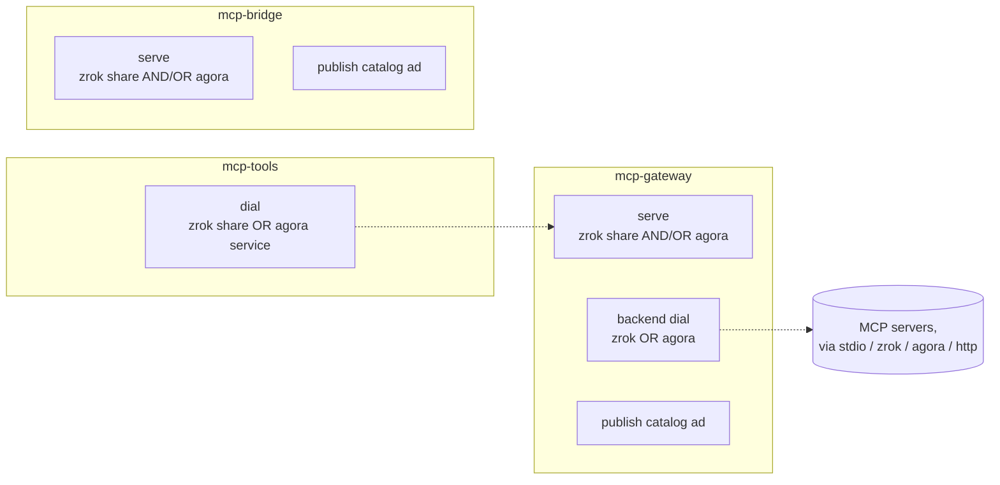

# mcp-gateway: Agora Integration Work Order

## Context

The Agora dashboard demo is driving toward a slice in which the mcp-gateway publishes itself in Agora's catalog and is reachable as a first-class Agora node. The dashboard design document scopes the *visible* outcome (a catalog card in the Agora dashboard), but the integration shape established by llm-gateway is broader: catalog publication is one of three independent affordances, alongside Agora Layer 1 serve and Layer 1 connect-to-upstreams. This work order brings mcp-gateway to the same integration depth.

After enabling Agora, the existing zrok plumbing in mcp-gateway continues to function unchanged. Agora is additive across all three trifecta binaries: anywhere a zrok share is used today, an Agora tunnel must be a parallel option.

References:
- `llm-gateway/docs/agora.md` — canonical narrative for the integration shape
- `llm-gateway/gateway/agora.go`, `agora_capabilities.go`, `agora_identity.go`, `agora_integration.go` — reference implementation
- `agora/docs/dashboard/design.md` §"Gateway Integration" — dashboard-facing requirements
- `agora/sdk/agent/` — public SDK consumed by gateway code (`agent`, `agent/tunnel`, `agent/catalog`)

## Scope

Three affordances, mirroring llm-gateway:

1. **Publish a catalog advertisement** so the gateway appears in the Agora dashboard's Catalog tab.
2. **Serve mcp-gateway / mcp-bridge over an Agora Layer 1 tunnel** — concurrently with the existing zrok share on mcp-gateway, or as the single transport for the invocation on mcp-bridge (see "Bridge and tools select a single transport" below).
3. **Aggregate / dial MCP backends through Agora Layer 1 services**, alongside today's `transport.type: zrok` backends in mcp-gateway's aggregator and alongside zrok share tokens consumed by mcp-tools.

All three binaries are in scope: `mcp-gateway`, `mcp-bridge`, `mcp-tools`. The gateway must be "fully operational against an Agora network, just like it is against zrok."

Bridge and tools select a single transport per invocation; mcp-gateway can run both concurrently. Concretely: `mcp-bridge` and `mcp-tools` are CLI-only binaries and pick zrok or agora at startup based on flags. `mcp-gateway` has a config file and exposes independent `zrok.share.enabled` and `agora.serve.enabled` toggles, so the same gateway instance can serve over both fabrics simultaneously when configured to.



## Architectural decisions (settled)

- **Shared package.** A new top-level `agora/` package, sibling to `aggregator/`, `bridge/`, and `gateway/`. All three binaries consume it. No per-binary fork.
- **Per-backend transport.** Aggregator's `BackendConfig.Transport.Type` gains `"agora"` with a new `agora_tunnel: <name>` field. (llm-gateway's equivalent field is currently named `agora_service`; mcp-gateway uses `agora_tunnel` to match Agora's canonical layer 1 vocabulary — see `agora/docs/layer-1/spec.md`. llm-gateway will be aligned in a follow-up.)
- **SDK boundary.** mcp-gateway consumes only the public Agora SDK surface (`sdk/agent`, `sdk/agent/tunnel`, `sdk/agent/catalog`). Workgroup and contract IDs are pre-resolved by `demo-bootstrap` and seated via an integration file, matching the llm-gateway pattern. No internal/api access required.
- **Serve model is multi-listener.** Today both `gateway.Backend` and `bridge.Bridge` serve their HTTP handler directly on the zrok share's `net.Listener`. To slot Agora alongside, the HTTP handler is constructed independently and bound to multiple listeners — one zrok-backed (existing behaviour) and one local listener that Agora's `EnsureServed` forwards into. Either, both, or neither can be enabled, gated by `cfg.Zrok.Share.Enabled` (default `true`) and `cfg.Agora.Serve.Enabled` (default `false`) — see B.1 and E.1. A gateway with both disabled fails fast at validation.

## Reference implementation map

Most pieces in mcp-gateway will be near-direct ports of llm-gateway equivalents, refactored for sharing across binaries:

| llm-gateway file | mcp-gateway equivalent |
| --- | --- |
| `gateway/agora.go` (subsystem) | `agora/subsystem.go` |
| `gateway/agora_identity.go` | `agora/identity.go` (per-binary identity defaults) |
| `gateway/agora_integration.go` | `agora/integration.go` |
| `gateway/agora_capabilities.go` | `agora/capabilities.go` (caller passes base caps) |
| `gateway/config.go` (AgoraConfig types) | `agora/config.go` |
| `docs/agora.md` | `mcp-gateway/docs/agora.md` |

The llm-gateway subsystem couples to `cfg.Providers.*.AgoraService` directly. The shared `agora/` package must invert this: the subsystem takes a list of `ConnectTarget{Key, Tunnel}` from its caller, so mcp-gateway's aggregator and mcp-bridge each collect their own targets and hand them in. mcp-tools collects exactly one.

## Tracks

### A. Shared `agora/` package skeleton

**A.1 Config types** — `agora/config.go`. Port llm-gateway's `AgoraConfig`, `AgoraAdvertisementConfig`, `AgoraServeConfig`, `AgoraIntegrationFile`, `AgoraIntegrationAdvertisement` verbatim except for type names (drop the `Agora` prefix since the package name now carries it: `Config`, `AdvertisementConfig`, `ServeConfig`, `IntegrationFile`).

**Drop `ServeConfig.BackendTarget`.** llm-gateway exposes a configured `serve.backend_target` field that operators set in YAML. In mcp-gateway's design (C.2 / E.2), the host always binds a runtime `127.0.0.1:0` listener and the *bound address* is the single source of truth for what `StartServing` advertises. There is no useful operator-facing value here. Remove the field from `ServeConfig` rather than carry it forward as a footgun. If preserving llm-gateway parity at the struct level matters, keep the field but reject any non-empty value in `ResolveConfig` / `Validate` with a clear error pointing at the runtime listener.

**A.2 Identity resolution** — `agora/identity.go`. Port `resolveAgoraIdentity` but parameterise the defaults: `Defaults{InstanceName, Description, TunnelMode, AgentNamePrefix}`. Each binary supplies its own defaults at construction time. AgentName composition (`"llm-gateway-" + instanceName`) becomes `defaults.AgentNamePrefix + "-" + instanceName`.

**A.3 Integration file** — `agora/integration.go`. Port `loadAgoraIntegrationFile`, `mergeAgoraIntegrationFile`, `resolveAgoraConfig`, `expandAgoraStrings`, `agoraAdvertisementPublish` verbatim. Rename function prefixes to drop `Agora`.

**A.4 Capabilities derivation** — `agora/capabilities.go`. The package exposes `Derive(base []string, extras []string) []string` — a thin helper that concatenates, deduplicates, and emits in stable order. Each binary derives its own caps externally and hands them in:
- mcp-gateway: `["mcp-tools"]` + sorted backend IDs from the aggregator config, + `"agora-serve"` when `cfg.Agora.Serve.Enabled`
- mcp-bridge: `["mcp-tools"]` + the bridge's command name (or a configured tag), + `"agora-serve"` when `cfg.Agora.Serve.Enabled`
- mcp-tools: not applicable (it doesn't publish)

The `"agora-serve"` tag mirrors llm-gateway's existing convention. Its conditional inclusion happens in each binary's caller (see Tracks C.3 and E.3), not in the shared package — `Derive` is content-agnostic.

If `cfg.Advertisement.Capabilities` is non-empty, it overrides derivation entirely (matching llm-gateway's behaviour).

**A.5 Subsystem lifecycle** — `agora/subsystem.go`. The core type:

```go
type Subsystem struct { /* private */ }

type SubsystemOptions struct {
    Config         *Config
    Defaults       Defaults              // identity defaults
    Capabilities   []string              // pre-derived; required only when PublishWanted is true and cfg.Advertisement.Capabilities is empty
    ConnectTargets []ConnectTarget       // for upstream backend connects
    ServeWanted    bool                  // host decides; checked against cfg.Serve.Enabled
    PublishWanted  bool                  // host decides; checked against cfg.Advertisement.Publish
}

type ConnectTarget struct {
    Key    string // logical key — e.g. backend ID
    Tunnel string // agora layer 1 tunnel name
}

func NewSubsystem(opts SubsystemOptions) (*Subsystem, error)
func (s *Subsystem) BootstrapConnects(ctx context.Context) error
func (s *Subsystem) StartServing(ctx context.Context, backendTarget string) error
func (s *Subsystem) StartPublishing(ctx context.Context) error
func (s *Subsystem) ConnectAddress(key string) (string, bool)
func (s *Subsystem) Close() error
```

**Publish/serve independence.** llm-gateway today couples publication inside `StartServing` (its `EnsureServed` is immediately followed by `EnsurePublished`). mcp-gateway diverges here: publication is split into its own method so the three affordances (publish / serve / connect) are genuinely independent at runtime, not just in config. Hosts call whichever subset they need:

- `BootstrapConnects` runs whenever `ConnectTargets` is non-empty.
- `StartServing` runs only when `ServeWanted`.
- `StartPublishing` runs only when `PublishWanted` — independent of serve. (A gateway that consumes Agora backends but doesn't serve Agora traffic can still publish its presence.)

`StartPublishing` calls `EnsurePublished` against the catalog. If both serve and publish are wanted, host calls `StartServing` first (so the advertisement reflects an actually-reachable endpoint), then `StartPublishing`.

Port the llm-gateway internals (`agoraOps` interface, `defaultAgoraOps`, `newAgoraSubsystemWithOps`, `BootstrapConnects`, `StartServing`, `Close`, cleanup-context helper), splitting the `EnsurePublished` call out of `StartServing` into the new `StartPublishing`. Keep the `agoraOps` seam for testability — it pays off in unit tests. `Close()` retracts the advertisement first (if published), then removes serve, then removes connects, then closes the agent — same order as today, just with publication retraction independent of whether serve was running.

**A.6 Unit tests** — port `gateway/agora_test.go`, `agora_capabilities_test.go`, `agora_identity_test.go`, `agora_integration_test.go` with adjustments for the new package layout. Use the same `agoraOps`-stubbing pattern.

**Acceptance:** `go test ./agora/...` passes. No imports of `aggregator/`, `gateway/`, `bridge/` from `agora/`.

---

### B. mcp-gateway: config wiring + run-time flags

**B.1 Config block** — extend `gateway/Config` (in `gateway/config.go`) with two additions:
- `Agora *agora.Config` — agora subsystem config.
- `Zrok *ZrokConfig` with `Share.Enabled bool` (default `true`) — toggle that gates whether the gateway creates a zrok share at startup. Default `true` preserves existing behaviour when the block is absent. When `false`, the entire zrok share creation path is skipped in `Backend.Start()`, and the gateway serves exclusively through whatever other listeners are enabled (typically the Agora local listener from C.2). This realizes the "either, both, or neither" architectural decision concretely.

`Validate()` validates the already-resolved config; it does *not* call `agora.ResolveConfig`. Resolution happens after CLI/env overrides are applied (see B.2), so it sees `cfg.Agora.Enabled` and `cfg.Agora.IntegrationFile` in their final form. Required ordering in `cmd/mcp-gateway/run.go`:

1. Load YAML config.
2. Apply CLI/env overrides (`--network`, `--agora-integration-file`, `AGORA_MCP_GATEWAY_INTEGRATION_FILE`).
3. When `cfg.Agora != nil && cfg.Agora.Enabled`, call `agora.ResolveConfig(cfg.Agora)` to expand env vars and merge the integration file.
4. Call `cfg.Validate()`.
5. Construct `gateway.Backend` (which constructs the subsystem inside `Start()`).

Validation also requires that at least one of {zrok share, agora serve} is enabled — a gateway with neither has no way to receive client connections; fail fast with a clear error.

**B.2 CLI flags** — in `cmd/mcp-gateway/run.go`:
- `--network <value>` — accepts `zrok` or `agora`. `--network=agora` sets `cfg.Agora.Enabled = true` after config load. `--network=zrok` is accepted but is a no-op; zrok sharing remains driven by existing config. The flag does *not* auto-disable zrok — to run agora-only, the operator sets `zrok.share.enabled: false` in config explicitly. This keeps mcp-gateway predictable and config-driven.
- `--agora-integration-file <path>` — overrides `cfg.Agora.IntegrationFile`.
- Environment variable `AGORA_MCP_GATEWAY_INTEGRATION_FILE` sets `cfg.Agora.IntegrationFile` when the flag is not supplied.

Precedence (matching llm-gateway): `--agora-integration-file` > `AGORA_MCP_GATEWAY_INTEGRATION_FILE` > `cfg.Agora.IntegrationFile`. Values inside the main config override values loaded from the integration file.

**B.3 Validation** — on load, when `cfg.Agora.Enabled`:
- `agora.api_endpoint` must match the enrolled environment endpoint (delegated to `agora.Subsystem` construction; surfaces as an error from `NewSubsystem`).
- When publishing is enabled, `advertisement.workgroup_ids` must contain at least one `wg_`-prefixed ID.

**Acceptance:** `mcp-gateway run --network=agora <config>` loads, validates, and either starts cleanly or returns a precise error citing the offending field.

---

### C. mcp-gateway: serve over Agora alongside zrok

**C.1 Refactor handler creation** — `gateway/backend.go`. Today `createHTTPServer()` returns a `*http.Server` with handler baked in. Split: `createHTTPHandler() http.Handler` (handler only) and keep server construction at each listener binding site. This is the smallest change that unblocks multi-listener.

**C.2 Local listener for Agora backend target** — when `cfg.Agora != nil && cfg.Agora.Serve.Enabled`, allocate a `127.0.0.1:0` listener at `Backend.Start()`, store its actual address on the `Backend` struct, and bind a second `http.Server` to it (using the same handler). Goroutine-served, lifetime managed in `Run()` and `Stop()` alongside the zrok server. The listener is opt-in: when agora serve is disabled, no localhost listener is allocated and no second server is started. Operators who never enable agora see no behavioural change.

**C.3 Subsystem construction** — in `Backend.Start()`, after the share is created and the local listener (if any) is bound:

```go
subsys, err := agora.NewSubsystem(agora.SubsystemOptions{
    Config:       b.config.Agora,
    Defaults:     agora.Defaults{
        InstanceName:    "mcp-gateway",
        Description:     "MCP tool gateway",
        TunnelMode:      "tcp",
        AgentNamePrefix: "mcp-gateway",
    },
    Capabilities:   agora.Derive([]string{"mcp-tools"}, capabilityExtras(b.config)),
    ConnectTargets: collectAgoraConnectTargets(b.config.Backends),
    ServeWanted:    cfg.Agora != nil && cfg.Agora.Serve != nil && cfg.Agora.Serve.Enabled,
    PublishWanted:  cfg.Agora != nil && cfg.Agora.Advertisement != nil && cfg.Agora.Advertisement.Publish,
})
```

`PublishWanted` is the *single source of truth* for whether `StartPublishing` will be called: it derives directly from `cfg.Agora.Advertisement.Publish`. No other place in the gateway pathway sets it.

`capabilityExtras` composes the per-backend IDs from `b.config.Backends` and appends `"agora-serve"` when `cfg.Agora.Serve.Enabled`. The tag mirrors llm-gateway's convention so cross-gateway catalog queries see a consistent marker.

`collectAgoraConnectTargets` is local to mcp-gateway (Track D) — same shape as llm-gateway's `collectAgoraConnectTargets`, but iterating `b.config.Backends` looking for `Transport.Type == "agora"`.

**C.4 Lifecycle ordering** — diverges slightly from llm-gateway because publish and serve are split (see A.5):

1. Construct subsystem.
2. `subsys.BootstrapConnects(ctx)` — runs whenever `ConnectTargets` is non-empty (Track D).
3. Start both HTTP servers (zrok-backed and/or agora local listener, per the toggles in B.1).
4. `subsys.StartServing(ctx, localListenerAddr)` — only when `cfg.Agora.Serve.Enabled`. Calls `EnsureServed`.
5. `subsys.StartPublishing(ctx)` — only when `cfg.Agora.Advertisement.Publish`. Calls `EnsurePublished`. Independent of step 4: a gateway can publish without Agora serve when it is still reachable through zrok (the zrok share carries the traffic; the catalog advertisement records the gateway's presence), or serve without publishing (private deployment). B.1's validation still rejects a gateway with *neither* a zrok share nor an Agora serve listener — publication does not bypass that requirement.

On `Stop()`: cancel HTTP servers first, then `subsys.Close()` which retracts the ad (if published) → removes serve (if active) → removes connects → closes the agent. Cleanup uses bounded contexts and continues past individual failures.

**C.5 Tunnel mode and backend-target derivation** — the gateway serves HTTP/SSE. Default tunnel mode is `tcp` (SDK serves raw bytes; the HTTP server speaks HTTP on top). `tunnel_mode: http` is also valid. The serve backend target is *derived from the bound runtime listener address*, not configured (see A.1):

- `tunnel_mode: tcp` → pass `"<host>:<port>"` (e.g. `127.0.0.1:54321`) to `StartServing`.
- `tunnel_mode: http` → pass `"http://<host>:<port>"` to `StartServing`.

Format the string just before the `StartServing` call, after the local listener is bound. There is no configured-value validation path here — the runtime address is always well-formed and always correct.

`udp` is not meaningful for an HTTP/SSE gateway; reject in identity resolution by passing a constrained `Defaults.AllowedTunnelModes` if we add that to the shared package, or rejecting at the binary level with a clear error.

**Acceptance:** with `agora.enabled: true`, `agora.serve.enabled: true`, and a running Agora controller, `mcp-gateway run` starts cleanly, the catalog shows the advertisement, an `agora` connect from another agent reaches the gateway's HTTP/SSE endpoint, and the existing zrok share keeps working concurrently.

---

### D. mcp-gateway: aggregator Agora backend transport

**D.1 Transport config** — `aggregator/config.go`:
- Extend `TransportConfig` with `AgoraTunnel string`.
- Add `"agora"` to the validation switch. `agora_tunnel` is required (trimmed, non-empty) when `type: agora`; mutually exclusive with stdio/zrok/http fields. `wg_` / `con_` ID validation lives in advertisement config (see A.1), not here — a backend tunnel is just a name.

**D.2 Connect bootstrap (eager)** — collected at `gateway.Backend.Start()` *before* `discoverTools`. The pattern:

```go
targets := collectAgoraConnectTargets(b.config.Backends)
// passed into agora.SubsystemOptions; BootstrapConnects() allocates one
// loopback listener per target and calls tunnel.EnsureConnected.
// subsys.ConnectAddress(backendID) -> "127.0.0.1:NNNN"
```

After `subsys.BootstrapConnects(ctx)`, the aggregator's backend manager can use the loopback address as the backend's effective endpoint.

**D.3 `connectAgoraBackend`** — `aggregator/backend.go`. New method, parallel to `connectZrokBackend`. It receives the loopback address (via dependency injection from the gateway layer — see D.4) and constructs an MCP `SSEClientTransport` against it:

```go
sseTransport := &mcp.SSEClientTransport{
    Endpoint: "http://" + loopbackAddr + "/sse",
    HTTPClient: http.DefaultClient,
}
```

Connect, list tools, return a `*Backend`. No `access` field (zrok-specific); Agora cleanup lives in the subsystem.

**D.4 Dependency-injection seam** — `BackendManager.Connect(ctx)` currently has no awareness of Agora. Two options:

(a) Add a `connectResolver` field on `BackendManager` — a `func(backendID string) (loopbackAddr string, ok bool)` — set by the gateway layer before `Connect` is called. The switch in `connectBackend` calls `m.connectResolver(cfg.ID)` for `type: agora` and fails fast if it returns `false`.

(b) Pre-resolve in `gateway.Backend.discoverTools` by rewriting `cfg.Transport.Type` from `agora` to a synthetic `http` with the loopback endpoint. Loses information; rejected.

Go with (a). Smallest viable seam. Define the resolver as a named type in `aggregator` (e.g. `type ConnectResolver func(backendID string) (loopbackAddr string, ok bool)`) so it can be reused unchanged by the per-client session path in D.5.

**D.5 Per-client session path** — `gateway/session.go`. `ClientSession.connectBackend` has its own transport switch (currently `stdio` / `zrok` / `http` / `https`), separate from `aggregator.BackendManager`. Discovery uses the aggregator; per-client tool calls use this switch. Both paths must learn `type: agora` or only discovery works.

- `NewSessionFactory` and `NewClientSession` accept the same `aggregator.ConnectResolver` from D.4. `gateway.Backend.Start()` constructs it from `subsys.ConnectAddress` and passes it into both `BackendManager` and `NewSessionFactory`.
- Add `case "agora":` to `ClientSession.connectBackend` that calls the resolver, fails fast if the backend isn't registered, and constructs an `mcp.SSEClientTransport` against `http://<loopbackAddr>/sse` with `http.DefaultClient`.
- No new fields on `sessionBackend` for Agora — the loopback listener and tunnel lifecycle live in the gateway-wide subsystem, not per-session. The session just dials the shared loopback. (Consequence: all client sessions share the same upstream Agora tunnel per backend, mirroring how the aggregator's discovery path uses it.)

**Acceptance:** an aggregator backend configured as `type: agora, agora_tunnel: filesystem-relay` lists tools at startup *and* successfully serves tool calls from a connected mcp-tools client — both the discovery path and the per-client session path route through the same loopback.

---

### E. mcp-bridge: serve + advertisement

**E.1 Config block** — `bridge/config.go` adds `Agora *agora.Config` and `Zrok *ZrokConfig` with `Share.Enabled bool` (default `true`), parallel to B.1. Same `--network=agora` and `--agora-integration-file` flags on `cmd/mcp-bridge/main.go` as Track B's mcp-gateway equivalents, plus an `AGORA_MCP_BRIDGE_INTEGRATION_FILE` env var. Same startup ordering as B.1: parse flags → apply overrides → call `agora.ResolveConfig` → validate → construct.

For `mcp-bridge`, `--network=agora` wires four things in the override step:
1. `cfg.Agora.Enabled = true`
2. `cfg.Agora.Serve.Enabled = true` — a bridge that advertises without serving is useless (no listening tunnel for `mcp-tools --agora` to reach).
3. `cfg.Agora.Advertisement.Publish = true` — without publication, the bridge never appears in the catalog and the demo's headline outcome silently disappears.
4. `cfg.Zrok.Share.Enabled = false` — bridge runs on one transport at a time. Mcp-bridge has no config file, so the flag itself flips zrok off; that's the only sensible mental model for a CLI-only binary.

If a future use case needs advertise-only or dual-transport bridges, add explicit opt-out flags (`--no-serve`, `--zrok`) then. For this slice, `--network=agora` is the complete agora-mode switch.

mcp-gateway does *not* get this auto-flipping — its serve and zrok states are independently driven by config fields, since gateways have reasons to run various combinations (zrok-only, agora-only, both, or consume-only).

**E.2 Handler refactor** — `bridge/bridge.go` `createHTTPServer()` splits the same way as Track C.1: handler construction separated from server binding.

**E.3 Subsystem construction** — in `Bridge.Start()`:

```go
subsys, err := agora.NewSubsystem(agora.SubsystemOptions{
    Config:   b.cfg.Agora,
    Defaults: agora.Defaults{
        InstanceName:    "mcp-bridge",
        Description:     "MCP single-server bridge",
        TunnelMode:      "tcp",
        AgentNamePrefix: "mcp-bridge",
    },
    Capabilities:  agora.Derive([]string{"mcp-tools"}, bridgeCapabilityExtras(b.cfg)),
    ServeWanted:   bridgeAgoraServeEnabled(b.cfg),
    PublishWanted: bridgeAgoraPublishEnabled(b.cfg),
})
```

`bridgeAgoraPublishEnabled` returns `cfg.Agora != nil && cfg.Agora.Advertisement != nil && cfg.Agora.Advertisement.Publish`. As with the gateway, this is the *single source of truth* for whether the bridge calls `StartPublishing`.

`bridgeCapabilityExtras` returns `[bridgeCommandTag(b.cfg)]` plus `"agora-serve"` when `cfg.Agora.Serve.Enabled`. `bridgeCommandTag` derives a single tag from the bridge's `Command` field (e.g. `mcp-server-filesystem` → `filesystem`).

When `Command` is a generic wrapper (`npx`, `npm`, `uvx`, `bunx`, `pipx`, `docker`), the bare command name is not useful in the catalog. In that case, walk `Args` and pick the first token that isn't a flag (no leading `-`) and isn't a recognized wrapper sub-verb (e.g. `npx -y` should skip `-y`); if the token contains `/`, take the segment after the last `/` (handles `@scope/pkg` and Docker `org/image` alike); then strip a leading `mcp-server-` / `server-` prefix from what remains. Examples:
- `npx -y @modelcontextprotocol/server-filesystem` → `filesystem`
- `uvx mcp-server-git` → `git`
- `docker run mcp/postgres` → `postgres`

An explicit override beats inference: add an optional `agora_capability_tag` field to `bridge/Config` that, when set, short-circuits the derivation. Operators with unusual launch patterns can name the tag directly.

Cover the inference rules with a table-driven test in `bridge/bridge_test.go` (or alongside wherever `bridgeCommandTag` lives). At minimum, codify the three documented examples (`npx -y @modelcontextprotocol/server-filesystem` → `filesystem`, `uvx mcp-server-git` → `git`, `docker run mcp/postgres` → `postgres`), a bare-command case (`mcp-server-filesystem` → `filesystem`), and the override case (`agora_capability_tag` set short-circuits to the explicit value). The test catches regressions when wrapper handling grows.

No backend connects — mcp-bridge wraps a single stdio process, no upstream Agora tunnels.

**E.4 Lifecycle** — same five-step ordering as Track C.4 (construct → bootstrap connects → start HTTP servers → `StartServing` if enabled → `StartPublishing` if enabled). For mcp-bridge in agora mode, `--network=agora` enables both serve and publish, so both calls fire. mcp-bridge's `Stop()` already iterates session cleanup; insert subsystem `Close()` before the share `Close()`.

**Acceptance:** `mcp-bridge --network=agora <command>` publishes its advertisement and serves the bridge's MCP handler on the Agora fabric. No zrok share is created (the flag flips `cfg.Zrok.Share.Enabled` to `false`); the bridge runs agora-only for this invocation. The existing `mcp-bridge <command>` (no `--network` flag, or `--network=zrok`) continues to serve over zrok exactly as before.

---

### F. mcp-tools: dial through Agora

**F.1 Command surface** — `cmd/mcp-tools/run.go` accepts a target argument today (the share token). Add a parallel target spec:

- `mcp-tools run <share_token>` — existing zrok behaviour, unchanged.
- `mcp-tools run --agora <tunnel>` — Agora dial in stdio mode. Mutually exclusive with a positional share token.
- `mcp-tools http <share_token> --bind 127.0.0.1:8080` — existing HTTP-mode zrok behaviour, unchanged.
- `mcp-tools http --agora <tunnel> --bind 127.0.0.1:8080` — Agora dial in HTTP mode. Mutually exclusive with a positional share token. Same `--stateless` / `--json-response` flags as the existing `http` mode.

Both forms support `--bind` and the existing flags. Same `--agora-integration-file` and `AGORA_MCP_TOOLS_INTEGRATION_FILE` plumbing as the other binaries; in this case the integration file is minimal (only `api_endpoint` and `env_root` are read — `mcp-tools` does not publish, so workgroup/contract IDs are not needed). Same startup ordering as B.1: parse args → apply overrides → call `agora.ResolveConfig` on the synthesized agora config → validate → construct the `agora.Client` (F.2).

**F.2 Agora client helper** — `agora/client.go` (added under the shared package). Thin facade over `Subsystem` for the dial-only use case:

```go
type Client struct { /* private */ }

func NewClient(opts ClientOptions) (*Client, error)
func (c *Client) Dial(ctx context.Context, service string) (loopbackAddr string, err error)
func (c *Client) Close() error
```

Internally constructs a `Subsystem` with `ServeWanted=false`, `Capabilities=nil`, `Advertisement.Publish=false`, calls `BootstrapConnects` with a single target, and returns the resulting loopback address from `ConnectAddress`. This keeps mcp-tools out of `tunnel.*` directly while still using the same lifecycle path.

**F.3 Wire stdio MCP traffic** — `tools/access.go` and `tools/client.go` already wrap a zrok `HTTPClient` and feed it into MCP transports. The Agora path is parallel: dial via `agora.Client.Dial(ctx, tunnel)`, then build an `mcp.SSEClientTransport` against `http://<loopbackAddr>/sse` with a stock `http.DefaultClient`. `tools/Access` is a struct, not an interface, today; the Agora path adds a sibling type (e.g. `AgoraDialer`) used directly by `tools/client.go`. The two transport paths stay parallel and uncombined.

**Acceptance:** `mcp-tools run --agora mcp-gateway-engineering` (against an Agora-served gateway from Track C) lists and calls tools end-to-end. `mcp-tools http --agora ...` likewise.

---

### G. demo-bootstrap handoff

**G.1 mcp-gateway integration file** — when demo-bootstrap provisions the `gateway-services-org` account, it writes an integration file at `<env_root>/integration.mcp-gateway.yaml` containing:

```yaml
api_endpoint: "http://127.0.0.1:18081"
env_root: "/path/to/.agora/envs/mcp-gateway"
advertisement:
  workgroup_ids:
    - wg_xxxxxxxxxxxx
  contract_id: con_xxxxxxxxxxxx
```

The mcp-gateway demo config picks this up via the `AGORA_MCP_GATEWAY_INTEGRATION_FILE` env var, set by `bin/demo-up.sh` when launching mcp-gateway.

**G.2 etc/demo-mcp-gateway.yml** — a minimal demo config under the agora repo (or in mcp-gateway's `etc/`) that enables Agora, declares a small backend set (defaults derived as `["mcp-tools", "filesystem"]` or whatever the demo backends are), enables `agora.serve.enabled: true`, and enables `agora.advertisement.publish: true`. The publish flag is non-optional for the demo — without it the catalog card (the headline outcome of this work order) never appears. Reviewers of demo configs should treat a missing `advertisement.publish: true` as a defect.

**G.3 Cross-repo coordination** — the demo-up.sh script in agora already invokes `mcp-gateway --network=agora`; with this work order, that invocation needs `AGORA_MCP_GATEWAY_INTEGRATION_FILE` exported and a config path argument. Coordinate with the agora dashboard work order's Track F.

**Acceptance:** running `./bin/demo-up.sh` in agora with `mcp-gateway` installed produces a card in the Catalog tab carrying the violet gateway-product gradient.

---

### H. Smoke + docs

**H.1 `docs/agora.md`** — mirror llm-gateway's doc structure, adapted to mcp-gateway's three-binary trifecta. Sections:
- Prerequisites
- Configuration (with examples for mcp-gateway, mcp-bridge, mcp-tools)
- CLI (per-binary flag table)
- Integration File
- Advertisement
- Serving Over Agora
- Per-backend `transport.type: agora`
- Connecting from mcp-tools
- Lifecycle

**H.2 `etc/mcp-gateway.yml` example** — extend the documented example config with a commented-out `agora:` block, the per-backend `transport.type: agora` example, and an `agora.serve.enabled` example.

**H.3 README updates** — small additions to the "Trifecta" table and the use-cases list. Reference `docs/agora.md` rather than duplicating.

**H.4 Manual smoke** — against a running agora controller + ziti fabric:

1. mcp-gateway with `agora.enabled: true`, `agora.serve.enabled: true`, `zrok.share.enabled: false` → mcp-tools connects via `--agora` and lists tools.
2. mcp-gateway with both `agora.serve.enabled: true` and `zrok.share.enabled: true` → both surfaces respond.
3. mcp-gateway with a `transport.type: agora` backend pointing at an mcp-bridge running with `--network=agora` → end-to-end tool call routes through two Agora hops.
4. Catalog dashboard shows the mcp-gateway card with the correct accent.
5. mcp-tools in HTTP mode: `mcp-tools http --agora <tunnel> --bind 127.0.0.1:8080` against the same Agora-served gateway from scenario 1; verify the local HTTP endpoint lists tools (e.g. `curl` against the SSE/streamable HTTP endpoint succeeds). Exercises the parallel HTTP code path so it can't silently diverge from `mcp-tools run --agora`.

**Acceptance:** all five smoke scenarios pass; observations captured in a brief `SMOKE.md` or appended to `docs/agora.md`.

---

## Out of scope (this slice)

- Agora-side persistent share equivalent (zrok's named-share story has no direct Agora analogue yet; revisit when Layer 2 advertisements grow stable-name semantics).
- Multiplexing one Agora connect across multiple aggregator backends. Today each `type: agora` backend gets its own connect and loopback; if many backends share an upstream service this is inefficient, but tractable and not a demo blocker.
- mcp-tools `--agora` writing the agora identity into the local zrok metadata cache. mcp-tools' two transport paths stay parallel and uncombined.
- Hardening around the local loopback listeners used as Agora `BackendTarget` (rate limiting, TLS, etc.). They listen on 127.0.0.1; that's the security boundary for MVP.

## Open questions

1. ~~**`agora-serve` capability tag.**~~ Resolved: replicate llm-gateway's convention. The conditional `"agora-serve"` append lives in each binary's caller (Tracks A.4, C.3, E.3) when `cfg.Agora.Serve.Enabled`.
2. ~~**Multi-listener serve as default or opt-in?**~~ Resolved: opt-in. When `agora.serve.enabled: false`, no localhost listener and no second `http.Server` are allocated. Matches llm-gateway's behaviour and keeps zero-agora operators on an unchanged code path.
3. ~~**mcp-tools transport disambiguation.**~~ Resolved: `mcp-tools run <share_token>` (positional, existing zrok form) and `mcp-tools run --agora <tunnel>` (flag, new agora form), mutually exclusive. Asymmetric on purpose — keeps existing zrok invocations and Claude Desktop configs working unchanged.

## Rollout order

Tracks are mostly independent after A lands. Suggested sequence:

1. A (shared package)
2. B + C in parallel — mcp-gateway run flag and serve story
3. D — aggregator backend transport
4. E — mcp-bridge (reuses A's package)
5. F — mcp-tools
6. G — demo-bootstrap coordination
7. H — docs and smoke

A through C is the minimum that produces a card in the dashboard. D extends the gateway to consume Agora-served backends. E and F complete the trifecta. G is the demo glue. H closes the loop.
